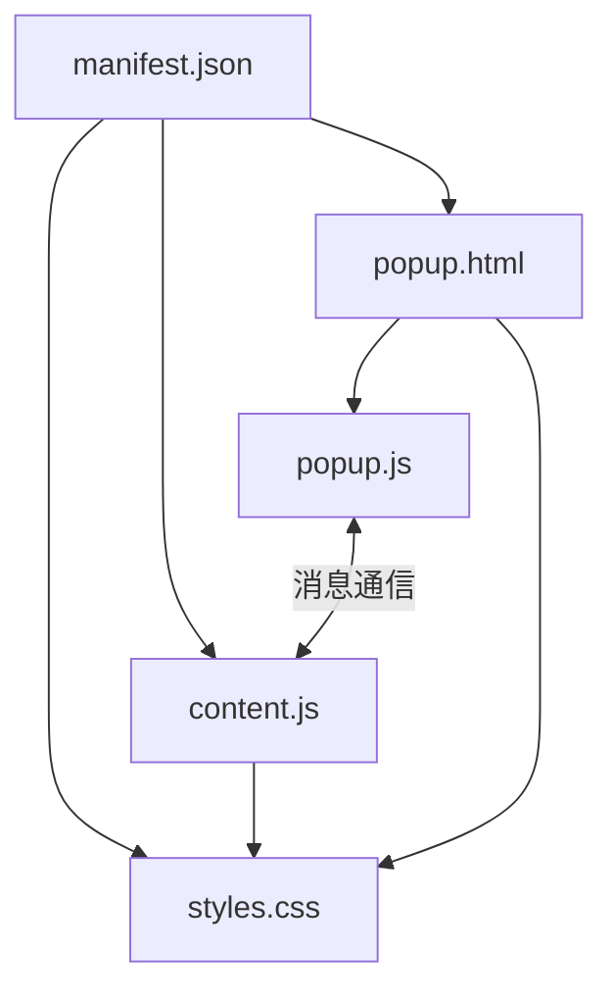
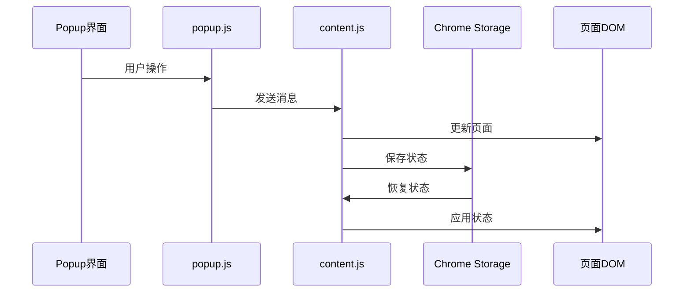
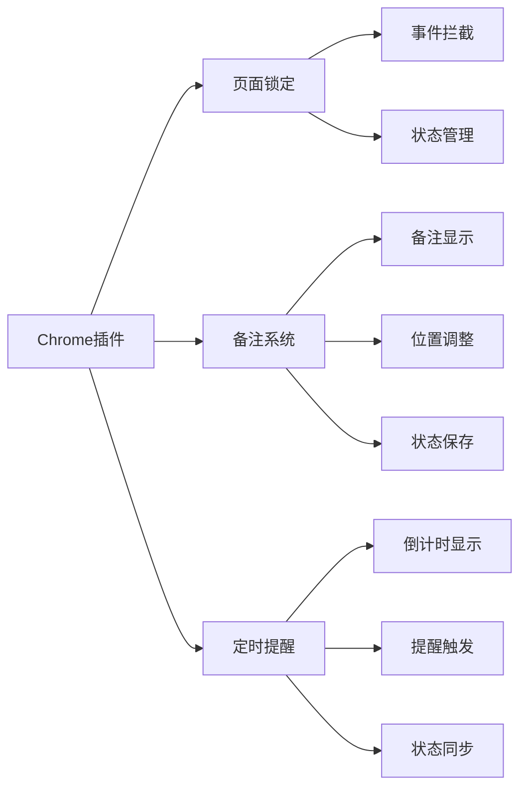
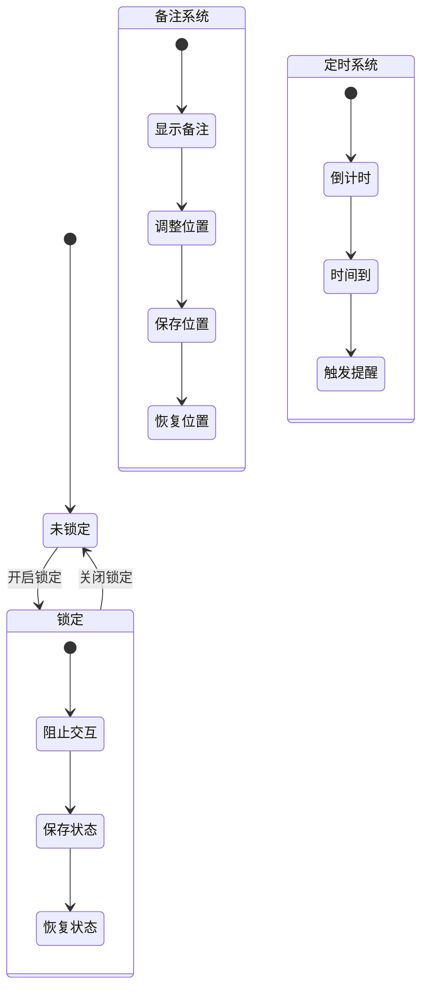

# Chrome 插件演示项目

## 项目简介
这是一个Chrome浏览器插件演示项目，主要功能是提供页面锁定/解锁功能和页面备注功能。当页面被锁定时，用户可以浏览和查看页面内容，但无法进行任何交互操作，包括点击、输入、复制等。同时，用户可以为每个页面添加自定义备注，并支持拖动、四角调整大小等功能。锁定状态会在页面刷新后保持，直到用户手动解除锁定。

## 功能需求
1. 开发一个Chrome浏览器插件
2. 提供一个开关按钮，可以锁定/解锁界面，实现以下功能：
   - 锁定时，页面上的信息可以刷新查看
   - 禁止所有鼠标点击操作
   - 禁止所有键盘输入
   - 禁止文本选择和复制粘贴
   - 禁止表单操作
   - 禁止拖拽操作
   - 页面刷新后保持锁定状态
3. 提供页面备注功能：
   - 可以为每个页面添加自定义备注
   - 支持选择备注显示位置（左上、右上、左下、右下）
   - 支持通过四个角调整备注大小
   - 支持自由拖动备注到任意位置
   - 备注内容持久化存储
   - 备注��示时不影响页面操作
   - 调整后的位置和大小会自动保存
4. 提供定时提醒功能：
   - 支持设置开始时间（格式：YYYY-MM-DD HH:mm:ss）
   - 支持输入分钟数，自动计算目标时间
   - 在备注框上显示倒计时
   - 时间到达时标签页闪烁提醒
   - 可以随时取消定时器
   - 页面刷新后保持定时器状态
5. 提供用户友好的界面和清晰的视觉反馈

## 项目结构
```
chrome_plugin_demo/
├── manifest.json        # 插件配置文件
├── popup.html          # 插件弹出窗口
├── popup.js           # 弹出窗口的控制逻辑
├── content.js         # 注入到页面的脚本
├── styles.css         # 样式文件
└── images/            # 图标文件夹
    ├── icon.svg       # SVG源文件
    ├── icon16.png     # 16x16图标
    ├── icon48.png     # 48x48图标
    └── icon128.png    # 128x128图标
```

## 技术实现
1. **manifest.json**: 
   - 使用 manifest v3 规范
   - 配置插件权限和基本信息
   - 设置content scripts和popup页面
   - 添加storage权限用于存储备注和锁定状态

2. **popup.html & styles.css**:
   - 实现简洁的用户界面
   - 包含开关按钮和状态显示
   - 使用CSS实现美观的开关效果
   - 为锁定状态��供明确的视觉反馈
   - 添加备注输入区域位置选择
   - 实现备注编辑界面的样式
   - 添加四角调整手柄的样式
   - 提供调整时的视觉反馈

3. **popup.js**:
   - 处理用户交互
   - 管理页面锁定状态
   - 与content script通信
   - 处理备注的保存和更新
   - 管理备注的本地存储
   - 同步锁定状态到storage
   - 页面刷新后恢复锁定状态

4. **content.js**:
   - 注入到目标页面
   - 实现全面的页面锁定功能：
     * 禁用所有表单元素（input、textarea、select、button）
     * 禁用所有链接点击
     * 阻止键盘事件（防止快捷键操作）
     * 阻止鼠标事件（点击、双击、右键等）
     * 阻止复制粘贴操作
     * 阻止拖拽操作
   - 使用事件捕获确保最高优先级
   - 实现页面备注的显示和更新
   - 管理备注元素的位置和样式
   - 实现备注的拖动功能
   - 实现四角调整大小功能：
     * 支持从任意角落调整大小
     * 保持内容相对位置不变
     * 提供最小和最大尺寸限制
     * 自动保存调整后的状态
   - 页面加载时自动恢复：
     * 检查并恢复锁定状态
     * 重新应用所有锁定操作
     * 恢复备注内容和位置

5. **锁定样式（styles.css）**:
   - 全��禁用鼠标事件
   - 禁止文本选择
   - 为所有子元素应用锁定样式
   - 提供多浏览器兼容性支持
   - 改变锁定状态下元素的视觉样式：
     * 表单元素显示为禁用状态
     * 链接变为灰色且无法点击
     * 鼠标指针显示为禁止图标
   - 定义备注显示的样式和位置
   - 实现四角调整手柄的样式：
     * 形可视手柄
     * 悬停效果
     * 不同角落的光标样式
     * 调整时的视觉反馈

6. **图标文件**:
   - 使用SVG格式设计基础图标
   - 提供三种尺寸的PNG图标（16x16, 48x48, 128x128）
   - 采用Material Design风格的蓝色（#2196f3）
   - 简洁的锁形状设计，符合插件功能

## 技术栈
- HTML
- CSS
- JavaScript
- Chrome Extension API
- Chrome Storage API
- SVG（图标设计）

## 开发环境
- Chrome浏览器
- 开发工具（VSCode等）

## 如何使用
1. 克隆项目到本地
2. 在Chrome浏览器中打开 `chrome://extensions/`
3. 开启右上角的"开发者模式"
4. 点击"加载已解压的扩展程序"
5. 选择项目文件夹
6. 点击工具栏中的插件图标：
   - 使用开关按钮控制页面锁定状态
   - 在文本框中输入页面备注
   - 选择备注显示位置
   - 点击保存按钮应用备注
   - 通过四个角调整备注大小
   - 拖动备注到任意位置

## 开发进度
- [x] 项目初始化
- [x] 基础框架搭建
- [x] 功能开发
- [x] 图标设计与实现
- [x] 增强页面锁定功能
- [x] 添加页面备注功能
- [x] 添加四角调整功能
- [ ] 测试与优化 

## 注意事项
1. 插件需要在Chrome浏览器中使用
2. 需要开启开发者模式才能加载本地插件
3. 页面锁定时仍然可以查看和刷新页面内容
4. 锁定功能会完全禁止页面上的所有交互操作，包括：
   - 鼠标点击
   - 键盘输入
   - 文本选择
   - 复制粘贴
   - 表单操作
   - 拖拽操作
5. 页面备注功能：
   - 备注内容会保存在浏览器本地存储中
   - 备注显示不会影响页面的正常操作
   - 页面刷新后备注依然保持
   - 不同页面可以设置不同的备注
   - 可以通过四个角调整备注大小
   - 可以自由拖动到任意位置
   - 位置和大小会自动保存

## 更新日志
### 2024-03-19
- 添加SVG格式的图标源文件
- 生成三种尺寸的PNG图标
- 更新项目文档，添加图标相关说明
- 增强页面锁定功能：
  * 添加全面的事件拦截
  * 增强视觉反馈效果
  * 提升锁定的安全性
  * 实现页面刷新后的状态保持
  * 修复锁定状态同步问题
  * 改进状态恢复机制
- 添加页面备注功能：
  * 实现备注的添加和编辑
  * 支持自定义备注位置
  * 添加本地存储支持
  * 优化备注显示效果
- 添加四角调整功能：
  * 实现四个角的大小调整
  * 添加调整手柄和视觉反馈
  * 保持内容位置不变
  * 添加大小限制
  * 自动保存调整后的状态
- 添加定时提醒功能：
  * 实现时间计算和倒计时显示
  * 添加标签页闪烁提醒
  * 持定时器状态持久化
  * 优化用户界面和交互体验

### 2024-03-20
- 优化备注和倒计时显示：
  * 将倒计时显示整合到备注框内
  * 减小倒计时字体和内边距
  * 优化视觉层级和布局
  * 确保内容不会重叠
- 改进状态保存和恢复：
  * 优化位置和大小的保存逻辑
  * 改进倒计时状态的持久化
  * 确保页面刷新后正确恢复
  * 修复定时器状态同步问题
- 错误处理优化：
  * 添加消息发送错误处理
  * 改进状态检查机制
  * 优化错误提示
- 代码健壮性改进：
  * 添加 content script 加载检查
  * 优化脚本注入逻辑
  * 添加错误恢复机制
  * 改进异步操作处理
- 用户体验优化：
  * 优化保存按钮反馈
  * 改进错误提示信息
  * 添加加载状态指示
  * 优化交互流程
- 备注位置优化：
  * 修改默认位置为页面中心偏上（距顶部 30%）
  * 添加新的位置选项 'center-top'
  * 优化位置选项的排序
  * 确保新建备注时使用默认位置
- 倒计时功能改进：
  * 修复倒计时显示消失的问题
  * 优化倒计时状态的保存和恢复
  * 改进倒计时位置的同步
  * 添加完整的错误处理

## 项目架构
### 文件关系图


### 数据流图


### 功能模块图


### 状态管理图


## 文件说明
1. **manifest.json**
   - 插件的配置文件
   - 定义权限和资源
   - 指定脚本注入规则

2. **popup.html/js**
   - 用户界面实现
   - 消息发送处理
   - 状态显示更新

3. **content.js**
   - 页面功能实现
   - 消息接收处理
   - DOM操作管理
   - 状态保存恢复

4. **styles.css**
   - 界面样式定义
   - 视觉效果实现
   - 交互反馈设计

## 数据流说明
1. **用户操作流**
   - 用户点击插件图标
   - popup.js处理操作
   - 发送消息到content.js
   - 执行相应功能
   - 保存状态到存储

2. **状态恢复流**
   - 页面加载完成
   - content.js初始化
   - 读取存储状态
   - 恢复页面状态
   - 重新应用功能

3. **消息通信流**
   - popup.js发送请求
   - content.js接收处理
   - 执行相应操作
   - 返回处理结果
   - 更新界面显示